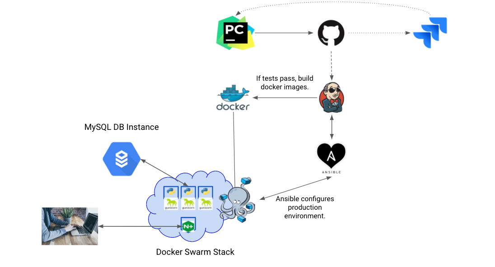

[//]: # (Implicit Links Within Project)

[1]: https://docs.google.com/spreadsheets/d/1dMUbgEsOmRcXkmD-zshyu050ahH6E2spgOlQVY6_hMM/edit?usp=sharing   "Risk Assessment"
[2]: https://docs.google.com/presentation/d/1kY_lDKnaryYASI6G5EJZPsZoxwhIXEfozJvWhLewHtk/edit?usp=sharing  "Presentation"
[3]: https://team-1579095236068.atlassian.net/jira/software/projects/QDA2/boards/5   "JIRA Project"
[4]: https://www.jetbrains.com/pycharm/guide/tutorials/visual_pytest/   "Visual PyTest"

# Mélodie

🎼 🎹 🎵 🎶 🪕 📻 🎤 🎺 🎧 🎻 🎙️ 👨‍🎤 👩‍🎤 🎷 🎸

**A melody machine for uninspired musicians.**

_Created for QA Consulting by Joshua Higginson_

## Contents
- [Pre-Project Reflection](#pre-project-reflection)
- [Project Brief](#project-brief)
  - [Resources](#resources)
  - [Requirements](#requirements)
- [Project Architecture](#project-architecture)
  - [Database Structure](#database-structure)
  - [CI Pipeline](#ci-pipeline)
  - [Front End Development](#front-end-development)
- [Testing](#testing)
 - [Unit Testing](#unit-testing)
- [Project Management](#project-management)
- [Project Review](#project-review)
  - [Known Issues and Future Optimisation](#known-issues-and-future-optimisations)
- [Contributors and Authors](#contributors--authors)
  - [Acknowledgements](#acknowledgements)

## Pre-Project Reflection

After having created gone through the process of designing an app, and coming face to face with failure, I’m ready to approach a new task. 

MiWell is on hold for the next two weeks, as I work on DevOps Project 2: Electric Boogaloo. 

#### Issue Estimation

In my first app, I was trying to make story point estimates to my issues, with really no understanding of ‘what’ a task actually entails, and little to know knowledge of ‘how long’ that task was going to take me.

With more experience, comes a more accurate understanding of project estimation.

The crux of my failure in my last project was designing an application using a ‘top down approach’ (not a bad thing in and of itself, if you have the ability to properly gauge time taken). Starting with the skeleton of a web framework, with no true grasp on fundamental intricacies. 

#### A Smarter Approach

Embracing their Taoist words of wisdom, Matt Hunt, lead trainer at QA, told me to embrace a new path:

For the first project, I had the mindset of an excited child in a sweet shop. ‘What can I possibly try and cram into these 5 weeks to make this project AWESOME.’ 

> ‘You’ve identified the flaws in your project management. That’s a good thing. Now working from your strengths, blow us away with a smarter approach rather than fancy, but broken code.’

### Project Planning - Improving JIRA

In my last project, the epics were broad and encapsulating of new technologies. This project, I am going to approach my epics in a slightly different light. 

This time, I want to keep a strict focus on achieving core functionality.

I’m not going to even touch a Flask route until I have the core functionality of each service wrapped inside of function, and unit tests has been ran.

At least for the first MVP sprint, I’m not going to touch a stretch goal or a user story.

### Child Issues

One subtask in my JIRA board will correspond to one ‘function’ in python. This comes with a number advantages, over my last approach in this mindset:

- We will have a a very clear definition of ready: A unit of code is to be wrapped in an encapsulating function. This function will correspond to a unit test.
- When this unit test hits 100% code coverage, passing our assertions, then the child issue is READY.
- When the ‘parent issue’ passes acceptance criteria, then it is DONE.
- Commits to VCS will be small and frequent.
- Commits to VCS will ALWAYS correspond to an issue in JIRA, and therefore we can automate project tracking via SCM polling.

### MoSCoW and Story Point Estimates

My ‘child issues’ will be marked with MoSCoW priority and T-Shirt story point estimates. These were incredibly beneficial to my last project. 

For project clarity, I want to provide the correct use-case for MoSCoW in an example situation.

Parent: Service #2. Design a random note generator.

Must/Highest Priority (this problem will block progress) : Generate a set of numbers between 1 and 13.

Should/ Medium Priority (has the potential to effect progress) : Map numbers between 1 and 13 to the notes of a chromatic scale in music. 

Could/ Low Priority (minor problem or easily worked around) : Change the starting pitch of your note, dependent on a given key.

Won’t/ Lowest Priority (trivial problem with little or no impact on progress) : Randomise notes in relation to the previous selection. (This should be a user story in a future sprint.)

### Parent Issues

One ‘parent issue’ will correspond to one page, or one service.

Whenever we initialise a parent issue, must have full acceptance criteria: 

~~~
Given <precondition>, 
When <condition>, 
Then <testable assertion>.
~~~

The precondition for this project must always be:

- Given that every child issue at our current stage of MoSCoW is ‘ready’...

### Global Project Restraints with MoSCoW.

If I’m the child in a candy shop, then MoSCoW will be the disgruntled parent who will be challenged with my supervision. 

God help them.

There is to be no working on ‘should’ child issues, until we hit two conditions.

Every ‘must’ child issue throughout the entire JIRA board is ‘marked as ready’.

Every parent issue must meet its acceptance criteria.

### Source Code Management

The best way for me to correctly implement JIRA integration with my source code management software will be to declare the following assertions: 
- One task or subtask within JIRA requires creating a new feature branch.
- When that task has reached its definition of ‘done’, then we close the branch, merge with master, and then close that branch.

### Epics

I’ll be simplifying the use of epics in this project:
I’ll be having an epic for ‘Documentation and Presentation’, one for ‘Software Development’, and one for ‘DevOps technologies’. 

Each epic will run in tandem over the course of the two weeks, with a common theme of DevOps integration.

#### Project Management Tools & Project Management Assistance

When thinking about the CI pipeline, the thing that irritates me most about JIRA , is the integration with VCS. The fact that you need to know your issue’s tracking number is a subjective pain!

Tracking numbers in JIRA are non descriptive, and therefore for a developer to FIND that number, they have to load up the website, browse for the issue they are currently working on, and then take note of that number, tab back into the CLI, add this tracking number to your git commit message.

### Project Management Integrations

JIRA server is integrated into our IDE using Tools -> Tasks and Contexts.

Time Tracking system integrated into my IDE using the Jetbrains Time Tracker Plugin -> Integrates with PyCharm tasks. Will manually push to the corresponding JIRA issue. (Currently no way of automating this feature.)

Git is integrated into our IDE using Jetbrains VCS. It is also integrated into JIRA, allowing us to update our JIRA project status with the use of GitHub smart commits.
I have automated the process of creating smart commit messages. We take variables from our PyCharm task metadata, which subsequently drawn from our JIRA server.
 
 Each commit is structured as so: {id} - {summary} : #comment

I integrated Jenkins within PyCharm, because I am too 'DevOps' to have to keep tabbing out of my IDE in order check the build status of my current job.
With this, I faced a minor issue with compatibility between Jenkins2 and Jenkins JetBrains plugin. The fix was simple - Log in with an API token, and make sure to include our 'crumb token', in order to protect against CSRF exploitation.
  

Jenkins is configured to build the master branch of our repo with gitSCM web hook polling.

### Workflow

PyCharm will automatically search our JIRA server for ‘tasks’. The moment we assign ourself to one of these new tasks, pulled from our Project backlog, a number of things happen:

- When we open a new issue, we automatically create a new feature branch with Git. This branch is automatically named by JIRA.

When we open a new issue, our time tracker automatically starts ticking.

When we hit ‘commit’, PyCharm will automatically create a commit message based on the active project which was assigned to us by JIRA. This commit message will already be in the required format for smart commits, all we need to do is add our comment on the end.

The only things we I haven’t currently automated is the ‘in progress and done’ states for each task. 

## Project Brief

The project brief was to design and implement a service-oriented application, comprised of four different at least four different applications which
 communicate with one another.
 
As part of my project submission, I have to provide a JIRA board, with full expansion on tasks needed to complete this project.

This application must be fully integrated, using a feature branch model, which will subsequently built with the use of a configured CI server, containerised, and deployed to GCP.

### Resources

- View my full risk assessment document [here.][1]
- View my project presentation [here.][2]
- View my JIRA Project [here.][3]

### Requirements

Software is **fully functional** and has been tested in ~~all~~ relevant areas. Best practices were **consistently adhered to** throughout the project.

Software produced is **in line with the documentation** with changes made where needed, with references to refactoring apparent within JIRA and this readme.

**VCS implemented**, and code was stored in a **structured manner** with branches, git ignore file and scripted hooks.
 
Build server installed and successfully built software after a push, with artefact produced for successful builds.

Although I personally struggled with writing relevant tests for services 1 and 4, I have 90% and 93% test coverages on services 2 and 3 respectively. Basic tests written for back-end.
  
Test results are tabulated and logged, in Jenkins.
   
A full Risk analysis has been performed.

Simple designs provided meeting the agreed standards and patterns.

System can be robustly deployed with no further configuration required, with the use of some more advanced deployment techniques, and with great consideration to the security and reliability of the system.

Deployment activities logged and discussed in a report. Tools and techniques used have been explained with the use of docstrings and a readme,

## Project Setup

The following section explains the manual configuration steps required to run our project.

1 - Create 4 new VM instances in GCP:

- Jenkins-Ansible-Driver
- Melodie-Manager-1
- Melodie-Worker-1
- Melodie-Worker-2

2 - Create an SQL database instance in GCP:
- Melodie-MySQL-Database (Make sure that the Public IP of our Jenkins driver
 and Melodie-Manager-1 are authorised.)

3 - Run our Jenkins install script on Jenkins-Ansible-Driver.

4 - Install required Jenkins plugins for this project:
- ChuckNorris
- Warnings Next Generation (For Pylint Test Reporting)
- JUnit (For Junit Test Reporting)
- Coburtura 

5 - Add Jenkins user to sudoers. Changed permissions of script created on my
 local computer.
 
6 - Add Jenkins user to the docker group and restart systemctl jenkins.

7 - We add our IP aliases to the Jenkins-Ansible-Driver /etc/hosts file.
 
8 - Add the SSH public key of Jenkins-Ansible-Driver to each other VM node.
 
9 - Add our private credentials to to Jenkins.
 
10 - Configure a new pipeline project, pulling down our git repo, and
 targeting the Jenkinsfile.

11 - Configure a new git SCM webhook within GitHub.

## Project Management

I spoke a lot about project management in my pre-project reflection. Suffice to say, I utilised a JIRA board in order to manage my project progress and time tracking. 

## Project Architecture

I tried to keep my project architecture as 'divisive' as possible, separating each individual service, or piece of app functionality within it's own unique directory.

### Database Structure

For this project, I wanted to ensure that the data within my database was stored in a robust and redundant manner.
 
I first approached MySQL, wanting to run it as a container from within our swarm. The Dockerfile for running a mySQL container is as follows:

`  service1_db:
  
    image: mysql:5.7

    volumes:
      - type: bind
        source: /mnt/gluster
        target: /var/lib/mysql

    environment:

      MYSQL_DATABASE: "NOT_THE_DATABASE"
      MYSQL_ROOT_PASSWORD: "NOT_THE_PASSWORD"

    ports:

      - target: 3306
        published: 3306
        protocol: tcp`
  
  
I soon found out that this was a rather unreliable way of hosting a database, due to a lack of a distributed volume option within docker swarm.

I tried using Google Cloud’s persistent disk feature, however it only offered read only functionality.

In order to get around this issue, I tried to run a GlusterFS distributed
file server over my nodes, however, I could not get this system functioning
with Ansible. It added far too much complexity in the limited week I had
 left.
 
So, I took it back to basics. Running a dedicated Google SQL instance of MySQL 5.7, which automatically manages data backup, security, and redundancy... And I had no more issues!

### CI Pipeline

My full CI pipeline is as follows:

#### Jenkins Workflow

For my CI server in this project, I chose to use Jenkins, over other popular services such as Travis, CircleCI and TeamCity.

Jenkins has official plugin support for docker swarm, which would make it considerably easier to deploy mélodie as a containerised microservice.
I implore Jenkins for it's third party support with Junit XML testing, with the ability to view our PyTest results on our build page.

I could have deployed Jenkins as it's own containerised service using Docker Swarm. 
For this project however, I chose running an instance of Jenkins on it's own independent VM within GCP. This was for a number of reasons:

- **Simplicity:** With the application that I am running currently being so
 small in scope, I won't ever require the need to scale up or scale out
 Jenkins in a containerised fashion. It would be an overkill waste of time, money, and resources. And it also meant that I could share some
 computing power, by running it on the same machine as our ansible driver.

- **Familiarity:** Within the time scale of this project, I do not have hours in the day required for me to learn the ins and outs of deploying Jenkins as a containerised service using Docker Swarm. 
- **Industry Standards:** After additional research, I discovered that a more widely supported and preferred approach to running Jenkins as a microservice is to run it using Kubernetes over Docker Swarm, with proprietary support from both Google and AWS.

We get Jenkins to pull our project repo from git, using a git webhook after every push. We then run Pytest, which outputs a Junit Test file with coverage. If our tests pass, Jenkins will subsequently build our docker images, automatically pushing them to docker.io.

I chose to write my jenkins shell scripts in sh, after executing them within the Jenkins command shell.

#### Docker

In order to ensure that lilypond would always be installed in the correct place, I chose to take a 'snapshot' of it as a docker image. Therefore, I configured 2 unique Dockerfiles, which would handle the installation of ubuntu, python3, and lilypond.

This project is doing very little in terms of complexity in regards to docker containers. So I would be surprised if there was something in my Dockerfile or docker-compose.yaml that you couldn't understand quite simply at this point!

#### Ansible

In this project, Ansible manages the docker install and docker swarm deployment process.

We start with running a common role, which ensures that GIT is installed on every machine. I then install docker, and docker's python dependencies to the docker install group.

I am using IP aliases with the /etc/hosts file on my ansible driver, in order
 to securely host this ansible inventory file on GitHub.

I prune any old docker images using docker_prune, to ensure that my VM’s aren’t always running out of hard drive space. I had this occur multiple times, which ends up bricking the virtual machine.

I then initiate a new swarm on my master node, before creating a new host, and registering the docker_swarm_info as a new host variable. This allows
 me to automatically add worker nodes to our swarm.

### Front End Development

Front end development was relatively painless. I knew that I wanted a 'one page' application, consisting of a simple form. After experimenting with some HTML layout, I threw on a bootstrap CSS stylesheet and called it a day!

The logic behind the actual service 1 took me quite a while to perfect. In particular, how I would translate our user's intentions, to a tangible end product.

## Testing

In my last project, I really struggled to run tests on my progress, due to the nature of my application factory.
One way in which I will achieve greater (Anything is greater than 0%!) unit test coverage is the use of PyCharm's integrated 'continuous' test runner.

An example use case of this method is shown in [this guide from JetBrains.][4]

For this project, I did some detailed research on tools for unit testing. For this project, I chose to use a PyTest test runner, because:
- After an initial learning curve, testing is a lot more efficient to write, and can be done in less lines of code than within something like unittest.
- As a relatively simple suite of applications, I do not require massively in depth testing tools. At what point is too much?
- Use of PyTest fixtures avoids constantly repeating myself. I hate repetition.
- If implemented correctly, tests read like "speech", and are simple to follow along.

### Unit Testing

Unit testing of our services took longer to write than the actual MVP code...
...But that's okay, I was reading information, and this challenged me to think about TDD with a professional understanding.

I chose to write the justification for each unit test using docstings, abiding by professional practice and to pep8 standards. 

Below is a brief summary of the tests within this appication.

#### Unit Testing Service #1

The test-file-melodie files within the file_output section of service 1 are vital for ensuring that our routes work!

The unit tests in service 1 are designed to test our common logic functionality, such as our listify, getting download names, and testing the ability to download a file from the correct url.

I particularly struggled with writing mock tests for service 1.

#### Unit Testing Service #2

I first approached testing from a musical perspective.

- There are 13 notes in a musical octave. Therefore, our random function should only return a set of numbers from 1 to 13.

Then, I approached testing in terms of a developer.

- We should only be returning integer values in this section of code. Degrees of a scale, NOT note names.

#### Unit Testing Service #3

Lilypond has a set of distinct markers which indicate note length. I created a PyTest fixture with these all in, allowing me to re-use these values for later tests.

- We check that the function works using common sets of note lengths - short, long, and extreme.

- Just like service #2, we check if the function only returns string and integer values.

#### Unit Testing Service #4

No unit tests were done on service 4, due to the ever increasing logic within the application, utilising Mingus and Lilypond objects. I still have no idea where to start!

### Known Issues and Future Optimisations

For the most part, I have been optimising this app in a continuous fashion, in response to the visual feedback from jenkins.
 
I have encountered an issue where gunicorn workers in service 4 will undergo critical failure. I wouldn't know where to start with this error.
 
If you are unlucky enough to try and download a file the moment after a container is getting cycled, then the random bar will 'go missing' and the user will encounter a 404 error. 

What went well:

Feel like I’m starting to have a solid understanding of of the topics we have been studying at QA.

- I have a fully working application, with only a few minimal bugs, beyond my comprehension on how to fix them.

- I have a great grasp of JIRA, and project management, especially JIRA integration with PyCharm tasks.

- I’ve managed to explain complex processes to other members of the cohort.

Even better if:

- Although my time management workflow is solid, I do still think that I was spending TOO much time trying to fix bugs in my Jenkins pipeline, particularly in relation to coding environment discrepancies from my development machine to the production environment.

- My testing abilities are improving, but really not perfect.

## Contributors & Authors

**Josh Higginson** - AUTHOR - _Junior DevOps Consultant for QA Consulting._

### Acknowledgements
Acknowledging Brian Okken for his book "Python Testing with PyTest", really
 helping me to nail my lack of TDD knowledge.
 
Jack Wallen from thenewstack.io, for the insightful article:"Create a
 Docker Swarm with Persistent Storage Using GlusterFS".
 
Cheers to Mark Atherton for imbuing your MIDI knowledge throughout Uni and
 inspiring this project.
 
Harry Volker & Luke Benson for continued mentorship throughout the academy.

Dad, Kier, Tobi, Ed, Beth, and all of the family and friends who are
 at the sidelines, cheering me on. 

